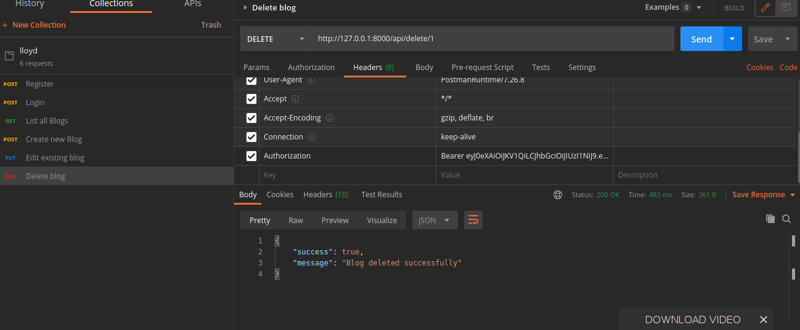

# lloyd_backend
PHP/Laravel simple blog and auth API 

## Project setup

```
composer install
```

### Initialize Database
```
php artisan migrate
```

### Initialize Server
```
php artisan serve
```

### Register


### Login


### Create new Blog


### Fetch all Blogs without Auth


### Edit Blog


### Delete Blog




### Customize configuration
See [Configuration Reference](https://cli.vuejs.org/config/).
